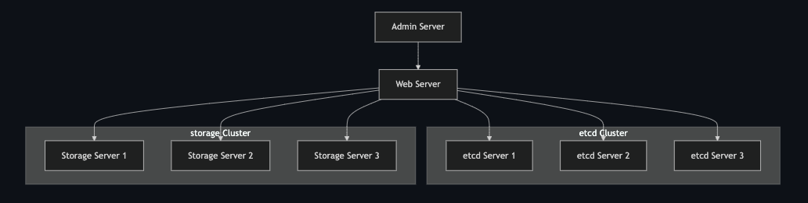

# Tritontube

A project from CSE-224 Networked services class.

This is a distributed video service built with Go and gRPC. It supports fault-tolerant metadata storage and scalable chunk-based video delivery.

## Architecture



## Distributed Video Storage

Videos are encoded into smaller chunks via MPEG-Dash. These chunks are then distributed to storage servers based on a consistent hash ring. Servers can be scaled horizontally to handle increased user load.

## Fault tolerant Metadata Storage

Metadata is stored in etcd, which uses Raft for distributed consensus. The system remains highly available with up to 2 of 5 metadata nodes offline.

# Launch servers

Storage server - launch one server per terminal. Can horizontally scale as large as desired.

```bash
go run ./cmd/storage -host '<ip>' -port '<port>' '<baseDir>'

#i.e
go run ./cmd/storage -host localhost -port 8090 "./storage/8090"
```

etcd servers - launch one server per terminal. Can horizontally scale as large as desired.
Ip addresses in setupenv.sh are local loopback for testing

```bash
bash setupenv.sh
```

Bring up each etcd server. For each HOST, 1,2,N run these commands in a new terminal

```bash
source setupenv.sh

THIS_NAME=${NAME_1}

THIS_IP=${HOST_1}

etcd --data-dir=data.etcd --name ${THIS_NAME} \
  --initial-advertise-peer-urls http://${THIS_IP}:2380 --listen-peer-urls http://${THIS_IP}:2380 \
  --advertise-client-urls http://${THIS_IP}:2379 --listen-client-urls http://${THIS_IP}:2379 \
 --initial-cluster ${CLUSTER} \
 --initial-cluster-state ${CLUSTER_STATE} --initial-cluster-token ${TOKEN}
```

```bash
# with sqlite
go run ./cmd/web \
    sqlite "./metadata.db" \
    nw     "localhost:8081,localhost:8090,localhost:8091,localhost:8092"

# with etcd distributed fault tolerant metadata key/value store db
go run ./cmd/web \
    etcd "127.0.0.1:2379,127.0.0.2:2379,127.0.0.3:2379" \
    nw     "localhost:8081,localhost:8090,localhost:8091,localhost:8092"
```

Admin Server - video chunk re-distribution

```bash
go run ./cmd/admin add localhost:8081 localhost:8090
go run ./cmd/admin remove localhost:8081 localhost:8090
go run ./cmd/admin list localhost:8081
```

# gRPC

```
protoc \
  --proto_path=proto \
  --go_out=internal/proto/storage --go_opt=paths=source_relative \
  --go-grpc_out=internal/proto/storage --go-grpc_opt=paths=source_relative \
  proto/storage.proto


```

# Docs

https://docs.google.com/document/d/1izFnibGVxzNRgpKl3RKt6_4gy64cN0ZEX8_GPLniasE/edit?tab=t.x8vofnrgqex1#heading=h.tee8x89zfyvi
